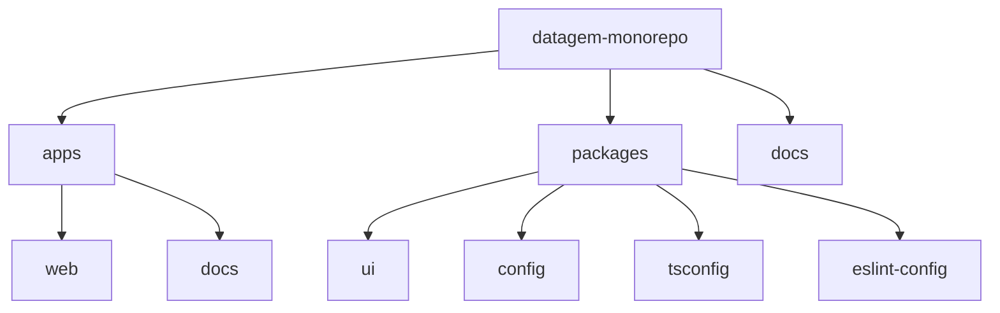

# Plano de Estruturação do Monorepo DataGem

## Visão Geral
Este documento detalha o plano de estruturação do monorepo para o projeto DataGem, uma plataforma SaaS de inteligência estratégica para performance de marketing digital.

## Tecnologias Principais
- Frontend: Next.js + Tailwind CSS
- Backend: Supabase
- Data Pipeline: Airbyte
- Gerenciador de Monorepo: Turborepo

## Estrutura do Monorepo



### 1. Diretórios Principais
- `/apps`: Aplicações principais
  - `/web`: Frontend em Next.js
  - `/docs`: Documentação do projeto (opcional)

- `/packages`: Bibliotecas compartilhadas
  - `/ui`: Componentes UI reutilizáveis
  - `/config`: Configurações compartilhadas
  - `/tsconfig`: Configurações base do TypeScript
  - `/eslint-config`: Configurações de linting

### 2. Arquivos de Configuração Root
- `package.json`: Dependências globais e scripts
- `turbo.json`: Configuração do Turborepo
- `.gitignore`: Arquivos a serem ignorados
- `README.md`: Documentação principal

### 3. Diretórios de Integração (a serem adicionados posteriormente)
- `/supabase`: Configurações do Supabase (migrations, seeds, etc.)
- `/airbyte`: Configurações do Airbyte (conectores, pipelines)

## Scripts Principais (package.json)
```json
{
  "build": "turbo run build",
  "dev": "turbo run dev",
  "lint": "turbo run lint",
  "test": "turbo run test",
  "clean": "turbo run clean"
}
```

## Próximos Passos
1. Inicializar o monorepo com Turborepo
2. Configurar o projeto Next.js na pasta apps/web
3. Configurar os pacotes compartilhados básicos
4. Preparar a estrutura para as integrações futuras

## Nível de Confiança
Nível de confiança para implementação: 9/10